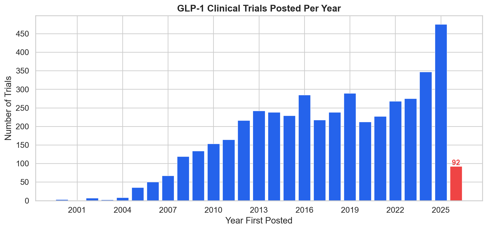
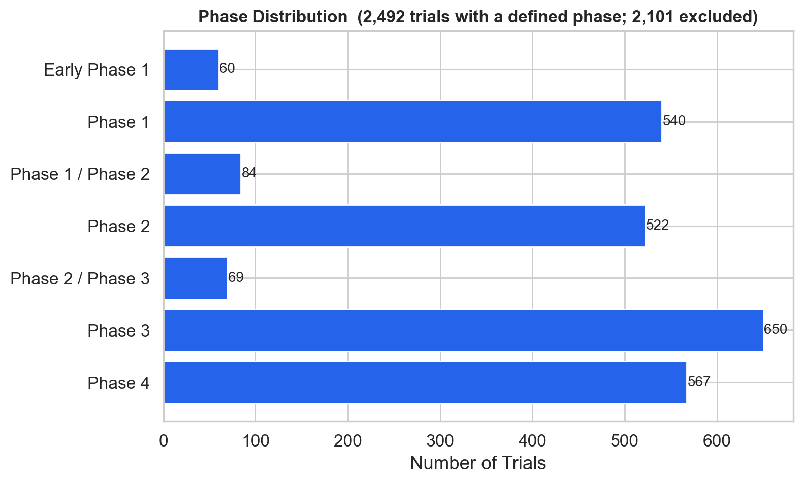
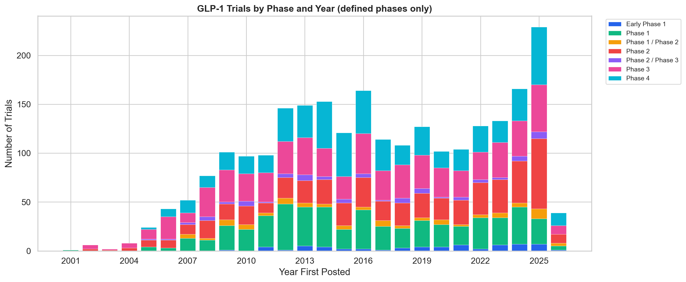
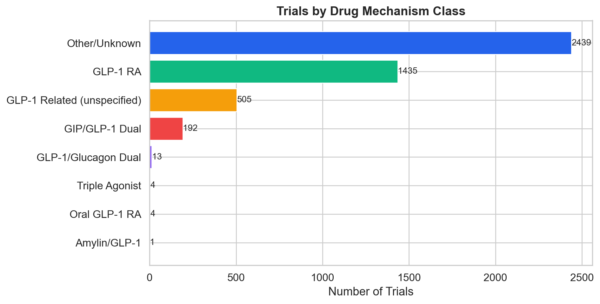
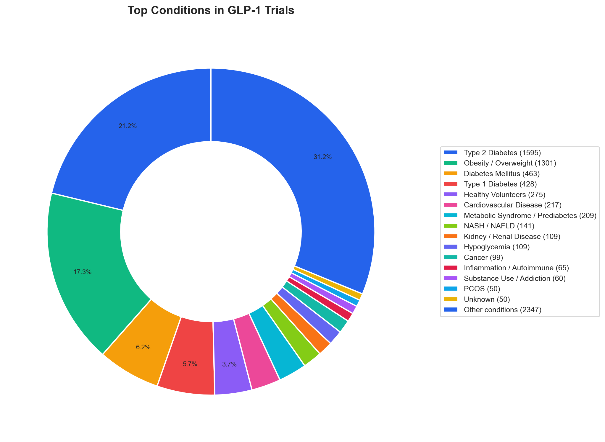
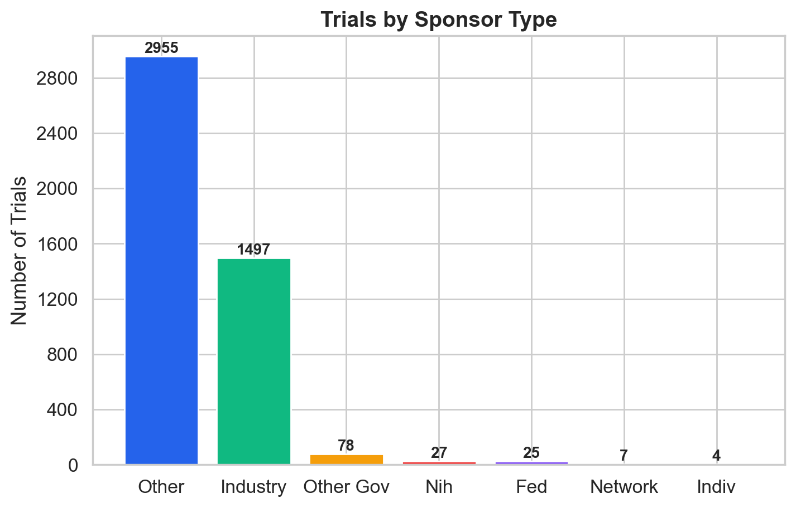

# GLP-1 Clinical Trial Analysis Pipeline

Replicating and extending a clinical trial analysis of **GLP-1 receptor agonists** originally presented in [this video](Video%20by%20jackiebrenner.mp4) by Jackie Brenner.

The original video walked through pulling GLP-1 trials from ClinicalTrials.gov, cleaning messy data, and exploring the results in spreadsheets. This project reproduces the full analysis programmatically — from raw API calls to publication-quality charts and an automated report.

## Results

- **[Full Analysis Report](output/report.md)** — tables, charts, and key findings
- **[HTML Version](output/report.html)** — rendered report viewable in a browser

## Key Numbers

| Metric | Value |
|--------|-------|
| Unique trials | 4,593 |
| Year range | 2000–2026 |
| Peak year (completed) | 2025 (475 trials) |
| Currently recruiting | 527 |
| Drug mechanism classes | 8 |
| Top condition | Type 2 Diabetes (1,595 trials) |

## Pipeline

Six self-contained Python scripts, run in sequence:

```
01_fetch_trials.py       Fetch & deduplicate trials from ClinicalTrials.gov API v2
02_clean_data.py         Normalize unicode, split conditions, flag data quality issues
03_classify_mechanisms.py Map interventions → mechanism classes (GLP-1 RA, dual, triple, etc.)
04_analyze_conditions.py  Normalize condition names, map to broad therapeutic categories
05_visualize.py          Generate 7 publication-quality charts
06_report.py             Produce Markdown + HTML report with tables, charts, and narrative
```

### Run it yourself

```bash
pip install pandas matplotlib seaborn
python 01_fetch_trials.py          # ~2 min (API calls)
python 02_clean_data.py
python 03_classify_mechanisms.py
python 04_analyze_conditions.py
python 05_visualize.py
python 06_report.py
```

No API key required. All data comes from the public [ClinicalTrials.gov API v2](https://clinicaltrials.gov/data-api/api).

## Charts

| Trials Per Year | Phase Distribution | Phase by Year |
|:---:|:---:|:---:|
|  |  |  |

| Drug Class | Top Conditions | Sponsor Types |
|:---:|:---:|:---:|
|  |  |  |

## Notable Finding

> **Pistachio Intake and Nutrition-Related Outcomes in Individuals on GLP-1 Therapy** (NCT07244445)
>
> Participants eat ¾ cup of pistachios per day while on GLP-1 therapy. Yes, really.

## Project Structure

```
├── 01_fetch_trials.py           # Step 1: Fetch from API
├── 02_clean_data.py             # Step 2: Clean & QA
├── 03_classify_mechanisms.py    # Step 3: Drug mechanism classification
├── 04_analyze_conditions.py     # Step 4: Condition normalization
├── 05_visualize.py              # Step 5: Chart generation
├── 06_report.py                 # Step 6: Report generation
├── md_to_html.py                # Markdown → HTML converter
├── PLAN.md                      # Detailed methodology & plan
├── transcript.md                # Original video transcript
├── data/                        # All intermediate & final data
│   ├── raw_trials.json / .csv
│   ├── cleaned_trials.csv
│   ├── classified_trials.csv
│   ├── conditions_expanded.csv
│   ├── condition_summary.csv
│   └── qa_report.txt
├── output/
│   ├── report.md / .html        # Final reports
│   └── charts/                  # 7 PNG charts
└── screenshots/                 # Frames extracted from original video
    ├── analysis/                # Chart screenshots from video
    └── spreadsheets/            # Spreadsheet screenshots from video
```

## Data Source

All trial data is fetched from the [ClinicalTrials.gov API v2](https://clinicaltrials.gov/data-api/api) using 11 search terms:

> GLP-1 receptor agonist, semaglutide, liraglutide, tirzepatide, exenatide, dulaglutide, lixisenatide, albiglutide, GLP-1, incretin mimetic, GIP/GLP-1

Results are deduplicated by NCT ID, yielding 4,593 unique trials.

## License

Data from ClinicalTrials.gov is in the public domain.
