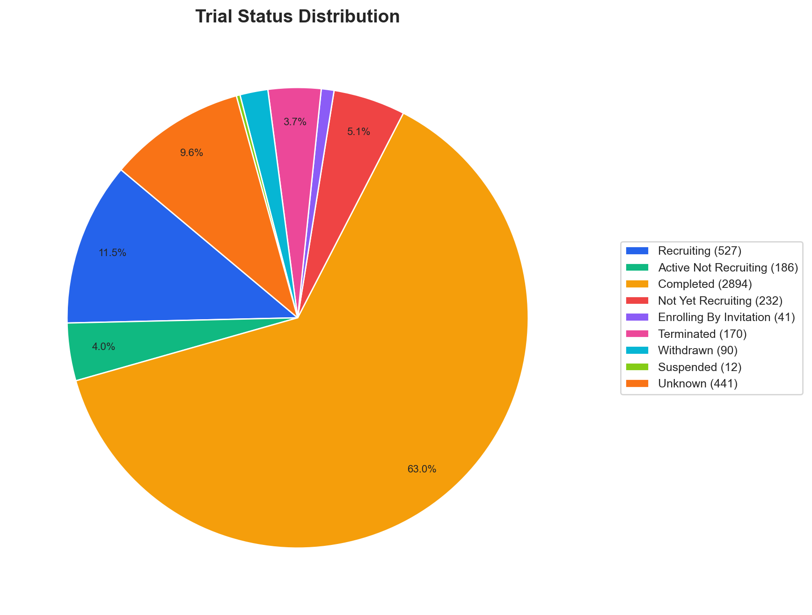

# GLP-1 Clinical Trials Analysis Report

*Generated 2026-02-28 13:12 — Data from ClinicalTrials.gov API v2*

## Executive Summary

This analysis covers **4,593** unique clinical trials related to GLP-1 receptor agonists and related therapies, posted between **2000** and **2026**.

- **92** trials already posted in 2026 (year in progress)
- **475** trials posted in 2025 — the highest completed year
- **986** trials currently active or recruiting
- **2894** trials completed
- **8** distinct drug mechanism classes identified

## Data Quality

The cleaning step identified the following issues in the raw data:

| Issue Category | Count |
| --- | --- |
| Total issues | 1187 |
| Drug names listed as conditions | 187 |
| Encoding issues fixed | 272 |
| Empty conditions | 0 |
| Empty interventions | 173 |
| Missing phase | 555 |
| Missing status | 0 |

*See `data/qa_report.txt` for full details.*

## Trial Status

| Status | Count | % of Total |
| --- | --- | --- |
| Completed | 2,894 | 63.0% |
| Recruiting | 527 | 11.5% |
| Unknown | 441 | 9.6% |
| Not Yet Recruiting | 232 | 5.1% |
| Active Not Recruiting | 186 | 4.0% |
| Terminated | 170 | 3.7% |
| Withdrawn | 90 | 2.0% |
| Enrolling By Invitation | 41 | 0.9% |
| Suspended | 12 | 0.3% |

## Phase Distribution

*Showing 2,492 trials with a defined phase. 2,101 trials excluded (NA = non-drug interventional, Not Specified = missing phase data).*

| Phase | Count | % of Phased Trials |
| --- | --- | --- |
| Phase 3 | 650 | 26.1% |
| Phase 4 | 567 | 22.8% |
| Phase 1 | 540 | 21.7% |
| Phase 2 | 522 | 20.9% |
| Phase 1 / Phase 2 | 84 | 3.4% |
| Phase 2 / Phase 3 | 69 | 2.8% |
| Early Phase 1 | 60 | 2.4% |

## Drug Mechanism Classes

| Mechanism Class | Count | % of Total |
| --- | --- | --- |
| Other/Unknown | 2,439 | 53.1% |
| GLP-1 RA | 1,435 | 31.2% |
| GLP-1 Related (unspecified) | 505 | 11.0% |
| GIP/GLP-1 Dual | 192 | 4.2% |
| GLP-1/Glucagon Dual | 13 | 0.3% |
| Triple Agonist | 4 | 0.1% |
| Oral GLP-1 RA | 4 | 0.1% |
| Amylin/GLP-1 | 1 | 0.0% |

## Therapy Type

| Therapy Type | Count |
| --- | --- |
| Non-drug | 1,680 |
| Combination | 1,394 |
| Monotherapy | 846 |
| Unknown | 673 |

## Sponsor Types

| Sponsor Class | Count |
| --- | --- |
| Other | 2,955 |
| Industry | 1,497 |
| Other Gov | 78 |
| Nih | 27 |
| Fed | 25 |
| Network | 7 |
| Indiv | 4 |

## Top Conditions

| Condition | Broad Category | Trial Count |
| --- | --- | --- |
| Type 2 Diabetes | Metabolic / Diabetes | 1595 |
| Obesity / Overweight | Obesity / Weight | 1301 |
| Diabetes Mellitus | Metabolic / Diabetes | 463 |
| Type 1 Diabetes | Metabolic / Diabetes | 428 |
| Healthy Volunteers | Other | 275 |
| Cardiovascular Disease | Cardiovascular | 217 |
| Metabolic Syndrome / Prediabetes | Metabolic / Diabetes | 209 |
| NASH / NAFLD | NASH / Liver | 141 |
| Kidney / Renal Disease | Kidney / Renal | 109 |
| Hypoglycemia | Metabolic / Diabetes | 109 |
| Cancer | Cancer | 99 |
| Inflammation / Autoimmune | Other | 65 |
| Substance Use / Addiction | Other | 60 |
| PCOS | Other | 50 |
| Unknown | Other | 50 |
| GI / Gastroparesis | Other | 49 |
| Neurological / Cognitive | Neurological | 45 |
| Dyslipidemia | Cardiovascular | 43 |
| Glucose Metabolism Disorders | Other | 32 |
| Hypertension | Cardiovascular | 25 |

## Charts

### Trials Posted Per Year

### Phase Distribution

### Phase Distribution by Year

### Drug Mechanism Class Distribution

### Top Conditions (Donut Chart)

### Trial Status Distribution

### Sponsor Types

## Notable Finding: The Pistachio Study

Among all the GLP-1 clinical trials, one stood out:

> **Pistachio Intake and Nutrition-Related Outcomes in Individuals on GLP-1 Therapy**
>
> NCT ID: NCT07244445 | Status: RECRUITING | Phase: NA

As the video creator noted: participants will eat 53 grams (¾ cup) of pistachios per day while on GLP-1 therapy.

## Methodology

1. **Data Fetch**: Queried ClinicalTrials.gov API v2 with 11 GLP-1-related search terms, paginated, and deduplicated by NCT ID

2. **Cleaning**: Unicode normalization, condition splitting, drug-as-condition flagging, year extraction

3. **Classification**: Mapped interventions to mechanism classes (GLP-1 RA, GIP/GLP-1 Dual, Triple Agonist, etc.) and therapy types

4. **Condition Analysis**: Normalized condition variants, mapped to broad therapeutic categories

5. **Visualization**: Generated 7 publication-quality charts

6. **Report**: This document

---

*Pipeline: `01_fetch_trials.py` → `02_clean_data.py` → `03_classify_mechanisms.py` → `04_analyze_conditions.py` → `05_visualize.py` → `06_report.py`*
